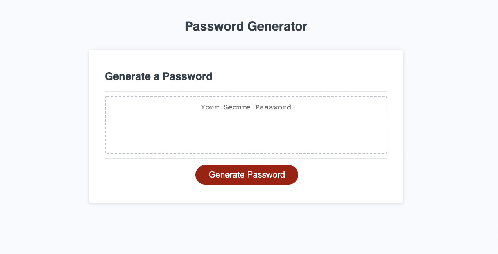

# Password generator

## Purpose

To create a functioning password generator using HTML, CSS and JavaScript

## Built With

- HTML
- CSS
- JavaScript

## Website

https://narcpat.github.io/password-generator/

## Contribution

Made with ❤️ by Patrick Narcisse (aka narcpat)

## Credits

This youtube video by Brad Traversy was instrumental, in helping me develop this project. It was particularly used to help me get through selecting characters and numbers for the password.

From Brad Traversy at Traversy Media
https://www.youtube.com/watch?v=duNmhKgtcsI

## Special Thanks

A special thanks to Learning assistants Jon and Beau for their assistance in helping me get over some of the hurdles with this project.
